<a id="top"></a>

<p align="center">
  <picture>
    <source media="(prefers-color-scheme: dark)" srcset="docs/media/banner-dark.svg">
    <source media="(prefers-color-scheme: light)" srcset="docs/media/banner-light.svg">
    
  </picture>
</p>

<p align="center">
  
  
  
  <a href="LICENSE"></a>
  <a href="https://github.com/DevL0rd/KBoard/stargazers"></a>
</p>

<h3 align="center">The on-screen keyboard Plasma deserves.</h3>

<p align="center">
  KBoard slides up from the bottom of your screen when you tap a text field, and types wherever you are.<br>
  Glide across the letters, talk instead of typing, send a GIF, or type the whole thing with a game controller.
</p>

<p align="center">
  <a href="#get-started"><b>Get started</b></a> ·
  <a href="#see-it-work"><b>See it work</b></a> ·
  <a href="#settings"><b>Settings</b></a> ·
  <a href="#command-line"><b>Command line</b></a> ·
  <a href="#privacy"><b>Privacy</b></a> ·
  <a href="#faq"><b>Questions</b></a> ·
  <a href="#more"><b>More projects</b></a>
</p>

<p align="center">
  
</p>

---

<a id="get-started"></a>

## 🚀 Get started

```sh
git clone --recursive https://github.com/DevL0rd/KBoard.git
cd KBoard
./install.sh
```

That's it. The installer builds KBoard into your home folder, tells KWin to use it as the on-screen keyboard (remembering the one you had), downloads the voice typing model and restarts your panel. Tap any text field and the keyboard comes up. The only time it asks for your password is to register the update hook on pacman systems.

> [!TIP]
> Add **KBoard** to your panel from **Add Widgets** to show and hide the keyboard by hand, and open **KBoard Settings** from your app launcher to make it yours.

<table>
  <tr>
    <td>🔄 <b>Update</b></td>
    <td>On pacman-based systems KBoard rebuilds itself with every system update and tells you when it's done. Anywhere else, run <code>git pull &amp;&amp; ./install.sh</code>. It's safe to repeat and keeps your settings, learned words and voice models.</td>
  </tr>
  <tr>
    <td>📦 <b>From a package</b></td>
    <td>Package builds run <code>./install.sh --aur</code> (or set <code>KBOARD_AUR=true</code>), so your package manager handles updates instead and no pacman hook is registered.</td>
  </tr>
  <tr>
    <td>🧹 <b>Remove</b></td>
    <td>Run <code>./uninstall.sh</code>. It gives the on-screen keyboard back to whatever KWin used before, removes the keyboard, the settings app and the update hook, and keeps your settings, learned words, clipboard pins and downloaded models.</td>
  </tr>
  <tr>
    <td>🖥️ <b>Needs</b></td>
    <td>KDE Plasma 6 on Wayland, Qt 6 (Quick, Wayland client, Multimedia), KDE Frameworks 6, CMake with Ninja, <code>whisper-cpp</code> and <code>ggml</code> for voice typing, <code>sdl3</code> for controllers, <code>hunspell</code> plus a dictionary for your language, and about 340 MB for the voice model. A graphics card is optional: install <code>ggml-cuda</code>, <code>ggml-vulkan</code> or <code>ggml-hip</code> and voice typing uses it. The installer checks everything first and lists whatever is missing.</td>
  </tr>
</table>

---

<a id="see-it-work"></a>

## 🎬 See it work

<p align="center">
  <picture>
    <source media="(prefers-color-scheme: dark)" srcset="docs/media/keyboard-dark.png">
    <source media="(prefers-color-scheme: light)" srcset="docs/media/keyboard-light.png">
    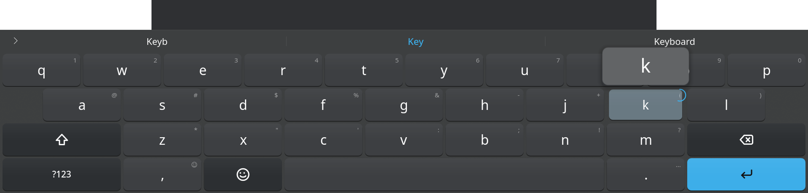
  </picture>
</p>

### ⌨️ Type, and it keeps up

<table>
  <tr>
    <td width="46%" valign="top">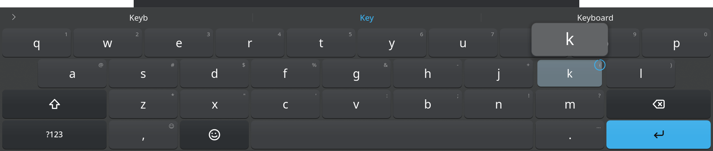</td>
    <td valign="top">
      <br>
      Three suggestions sit above the keys. The middle one is the word KBoard would correct to, so a space takes it. Tap another to use it instead, and hold one to make KBoard forget a word it learned.
      <br><br>
      Autocorrect knows which keys sit next to each other, so <i>tjis</i> becomes <i>this</i> and the fixed word flashes for a moment. Press backspace right after a correction and you get your own word back, kept for next time.
      <br><br>
      It capitalises sentences, turns a double space into a full stop, tidies the space around punctuation, and finishes short cuts like <code>omw</code> into <i>On my way!</i>. Next-word prediction fills the strip after every space.
    </td>
  </tr>
</table>

### 🌊 Glide across the letters

<table>
  <tr>
    <td valign="top">
      <br>
      Put a finger on the first letter, slide through the rest and lift. A glowing trail follows you, the word lands with a space after it, and the other words it could have been wait in the suggestion strip.
      <br><br>
      Two more gestures live on the bottom row: slide along the space bar to move the cursor letter by letter, and slide left from backspace to select whole words and delete them when you let go.
      <br><br>
      Every gesture can be turned off on its own under <b>Glide &amp; Gestures</b>.
    </td>
    <td width="46%" valign="top">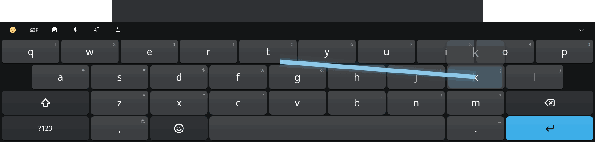</td>
  </tr>
</table>

### ✋ Hold a key for more

<table>
  <tr>
    <td width="46%" valign="top">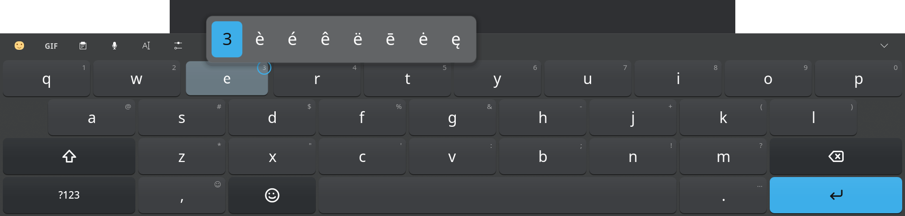</td>
    <td valign="top">
      <br>
      Hold a letter and its accents open above it: <kbd>e</kbd> gives you è é ê ë ē ė ę. Keep sliding to the one you want and let go. A small ring fills on the key while you hold, so you always know it's coming.
      <br><br>
      The corner of each key shows what a hold gives you: numbers on the top row, symbols below. Hold the full stop for punctuation, the comma for emoji, and the space bar to switch language when you have more than one.
      <br><br>
      Double-tap <kbd>Shift</kbd> for caps lock. <kbd>Ctrl</kbd>, <kbd>Alt</kbd> and <kbd>Super</kbd> on the desktop row work the same way: one tap for the next key, two taps to hold them down.
    </td>
  </tr>
</table>

### 😀 Emoji, right where you type

<table>
  <tr>
    <td valign="top">
      <br>
      The emoji panel opens inside the keyboard with the categories along the top, your recents first and favourites one hold away. Search by word and the results come up as you type.
      <br><br>
      Hold an emoji to pick a skin tone, and KBoard remembers that choice for that emoji. Kaomoji like <code>¯\_(ツ)_/¯</code> have their own tab.
      <br><br>
      While you type, emoji you might mean show up in the suggestion strip next to the words.
    </td>
    <td width="46%" valign="top">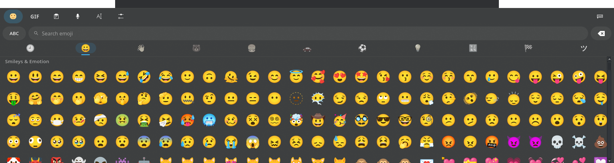</td>
  </tr>
</table>

### 🎞️ Send a GIF without leaving the keyboard

<table>
  <tr>
    <td width="46%" valign="top">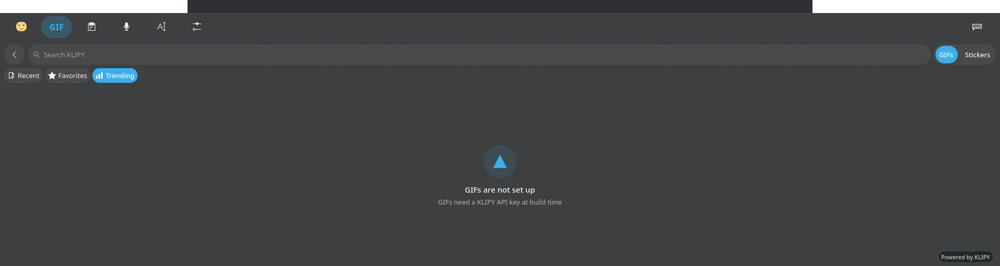</td>
    <td valign="top">
      <br>
      Trending GIFs and stickers, search, and a masonry grid that plays as you scroll. Hold one to keep it in favourites; the ones you send stay in recents.
      <br><br>
      Tap a GIF and KBoard pastes it straight into the chat you're in. Apps that don't take pasted images can have the link instead: set <b>Insert GIFs as</b> to <b>Link</b>.
      <br><br>
      A safety filter is on by default, and you can turn the panel off completely.
    </td>
  </tr>
</table>

### 📋 Everything you copied

<table>
  <tr>
    <td valign="top">
      <br>
      The clipboard panel keeps what you copy, with images as thumbnails, links with their site, and one-time codes picked out as <b>Verification code</b> so you can paste them with one tap.
      <br><br>
      Tap to paste, swipe an item away to remove it, hold it to pin it. Pinned items never expire. Everything else clears after an hour by default, and the history lives in memory unless you ask for it to be kept.
      <br><br>
      Copy something while the keyboard is open and it appears as a chip above the keys for a few seconds, ready to paste.
    </td>
    <td width="46%" valign="top">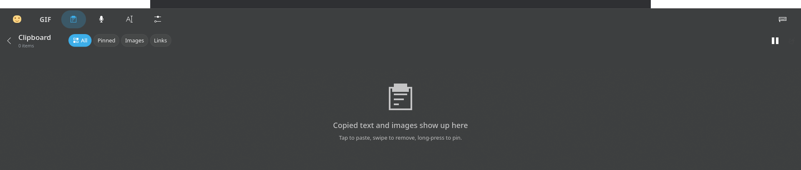</td>
  </tr>
</table>

### 🎙️ Talk instead of typing

<table>
  <tr>
    <td width="46%" valign="top">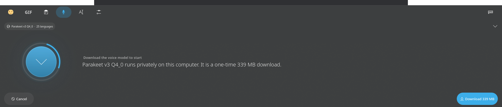</td>
    <td valign="top">
      <br>
      Tap the microphone and talk. The words appear underlined while you speak and land in the field when you stop. The orb moves with your voice, and a pause of about a second ends the sentence.
      <br><br>
      It runs on your machine. Parakeet v3 is the model that comes with KBoard: 25 European languages, punctuation and capitals included, quick enough on a plain CPU. Whisper models are a download away for the other 99 languages, and a graphics card is used when there is one.
      <br><br>
      Say “new line”, “period”, “comma”, “question mark” or “delete that” and KBoard does it instead of typing the words.
    </td>
  </tr>
</table>

### 🎮 Type with a controller

<table>
  <tr>
    <td valign="top">
      <br>
      Move between keys with the D-pad or the left stick and press with <b>A</b>. <b>B</b> is backspace, <b>X</b> is space, <b>Y</b> is shift, the shoulder buttons move the text cursor, the triggers flip between panels, <b>Start</b> is enter and <b>Back</b> hides the keyboard.
      <br><br>
      Hold <b>Back</b> + <b>X</b> in any text field to bring the keyboard up without touching the mouse. The buttons in the settings app show the glyphs of the controller you actually have, whether it's an Xbox, PlayStation, Nintendo or Steam Deck pad.
      <br><br>
      Controllers are picked up when you plug them in, Steam's virtual pad doesn't type everything twice, and a short rumble tells you a key went in.
    </td>
    <td width="46%" valign="top"></td>
  </tr>
</table>

### 🤲 Splits for wide screens

<table>
  <tr>
    <td width="46%" valign="top">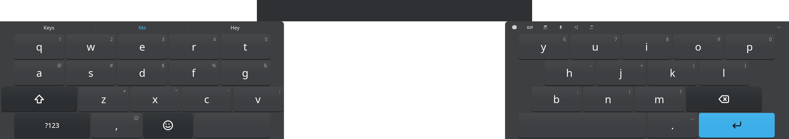</td>
    <td valign="top">
      <br>
      On a wide screen the keyboard splits into two halves, one under each thumb, and the gap in the middle stays clickable for the app underneath. The halves slide apart when it happens.
      <br><br>
      KBoard decides on its own from the shape of your screen, or you can set it to always or never, and choose how wide each half is.
      <br><br>
      It is always docked along the bottom edge, and it resizes itself when you rotate the screen, change resolution or move to another monitor.
    </td>
  </tr>
</table>

### ✨ And the little things

<table>
  <tr>
    <td width="33%" valign="top">
      <h4>🎨 Your Plasma colours</h4>
      Keys, panel and accent come from your colour scheme and follow it live. Four key styles, blur behind the panel, and your own corner radius, gaps and label size.
    </td>
    <td width="33%" valign="top">
      <h4>🔊 Sounds worth hearing</h4>
      Soft, Mechanical, Typewriter, Bubble and Glass packs, with a little random variation so it never sounds like a machine gun. Vibration too, where the hardware has it.
    </td>
    <td width="33%" valign="top">
      <h4>🧠 Fields it understands</h4>
      An email field gets an <kbd>@</kbd> key, a web address gets <kbd>/</kbd>, number and phone fields get a keypad, and password fields get no suggestions and no learning.
    </td>
  </tr>
  <tr>
    <td valign="top">
      <h4>🖥️ A desktop row</h4>
      Turn it on for <kbd>Esc</kbd>, <kbd>Tab</kbd>, <kbd>Ctrl</kbd>, <kbd>Alt</kbd>, <kbd>Super</kbd>, arrows, Home, End, Page Up and Page Down, with <kbd>Fn</kbd> for F1–F12 and Delete.
    </td>
    <td valign="top">
      <h4>🌍 Layouts and languages</h4>
      QWERTY, QWERTZ, AZERTY, Spanish, UK, Dvorak and Colemak, plus symbols, more symbols, number pad and phone pad pages. The globe key and a swipe on the space bar switch between the ones you use.
    </td>
    <td valign="top">
      <h4>✏️ An editing panel</h4>
      Select, select all, copy, cut, paste, undo, redo, Home and End, in a panel inside the keyboard, so you don't have to aim at tiny handles.
    </td>
  </tr>
  <tr>
    <td valign="top">
      <h4>👆 Keys that feel right</h4>
      Keys dip and spring back, a bubble pops above the one you hit, a ripple starts where your finger landed, and holding backspace deletes faster the longer you hold.
    </td>
    <td valign="top">
      <h4>👇 Out of the way</h4>
      Swipe down on the keyboard to hide it, or use the hide key. KWin moves the window above the keyboard while it's up and puts it back when it goes.
    </td>
    <td valign="top">
      <h4>🐣 It takes over cleanly</h4>
      The installer remembers the keyboard KWin used before, and uninstalling gives it straight back.
    </td>
  </tr>
</table>

<p align="right"><a href="#top">back to top ⬆</a></p>

---

<a id="settings"></a>

## 🎛️ Settings that show you

<table>
  <tr>
    <td valign="top">
      <br>
      <b>KBoard Settings</b> is its own app. Every page has a live keyboard above it that plays what the setting does: the keys change shape as you drag the corner slider, a finger draws a glide trail, a typo gets corrected, the mic orb listens.
      <br><br>
      Changes apply to the running keyboard as you make them. Anything you changed gets a dot next to it and a one-click reset, there's an undo, and the whole lot can be exported to a file and imported again.
      <br><br>
      Search reaches every row: type <i>sound</i>, <i>accent</i> or <i>rumble</i> and the app jumps to the setting and highlights it.
    </td>
    <td width="46%" valign="top">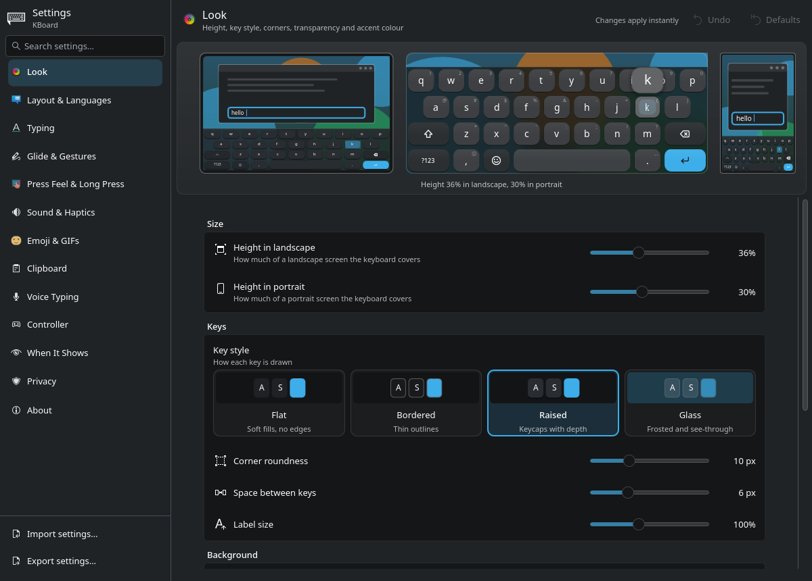</td>
  </tr>
</table>

<table>
  <tr>
    <td width="33%"><p align="center"><b>Look</b> — height, key style, corners, transparency and accent</p></td>
    <td width="33%">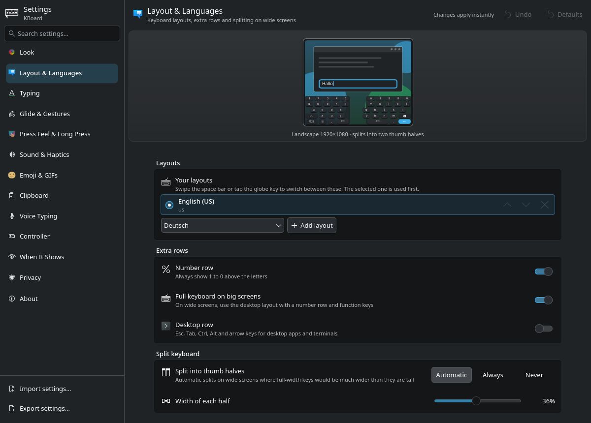<p align="center"><b>Layout &amp; Languages</b> — layouts, extra rows and splitting</p></td>
    <td width="33%">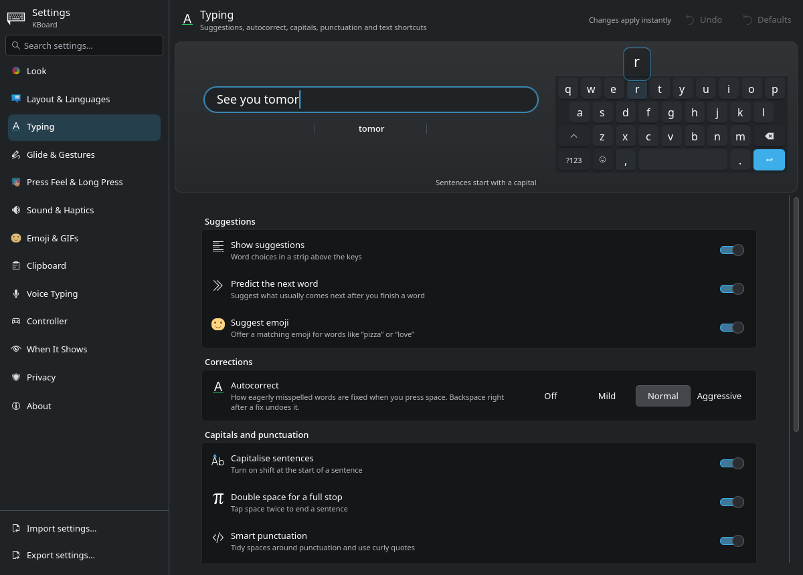<p align="center"><b>Typing</b> — suggestions, autocorrect, capitals and shortcuts</p></td>
  </tr>
  <tr>
    <td>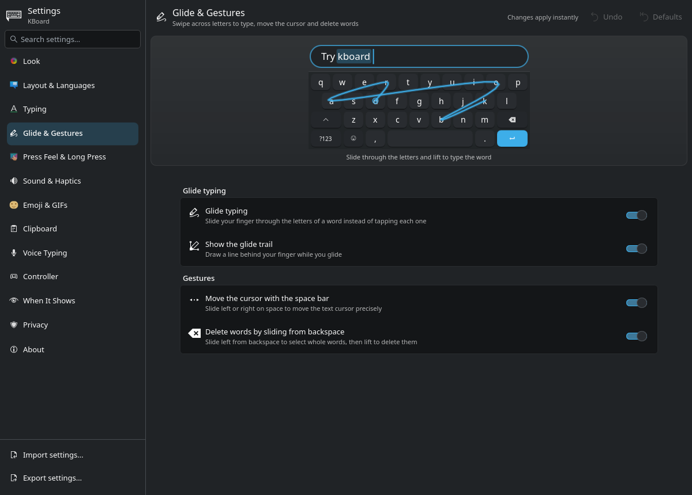<p align="center"><b>Glide &amp; Gestures</b> — gliding, cursor and word deleting</p></td>
    <td>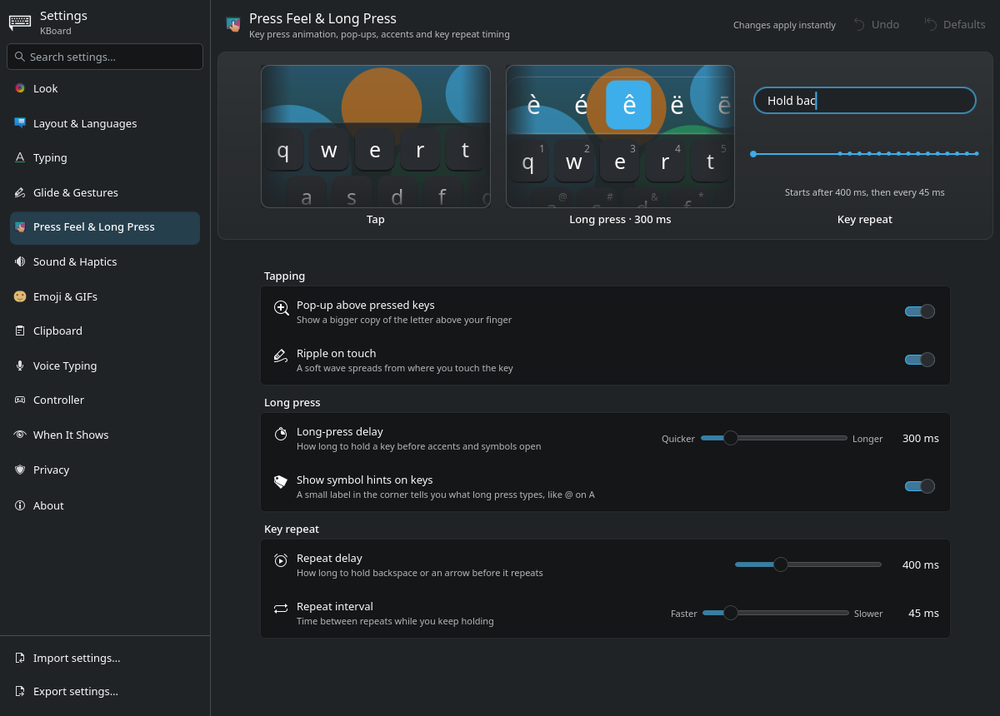<p align="center"><b>Press Feel &amp; Long Press</b> — pop-ups, ripples, hold and repeat</p></td>
    <td>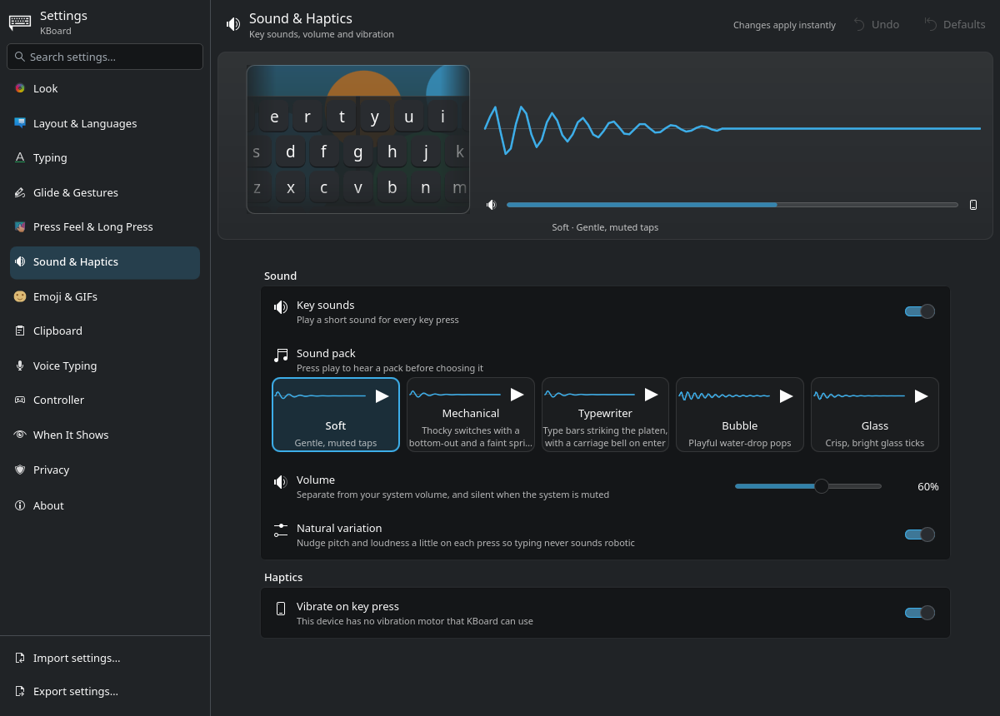<p align="center"><b>Sound &amp; Haptics</b> — packs you can audition, volume, vibration</p></td>
  </tr>
  <tr>
    <td>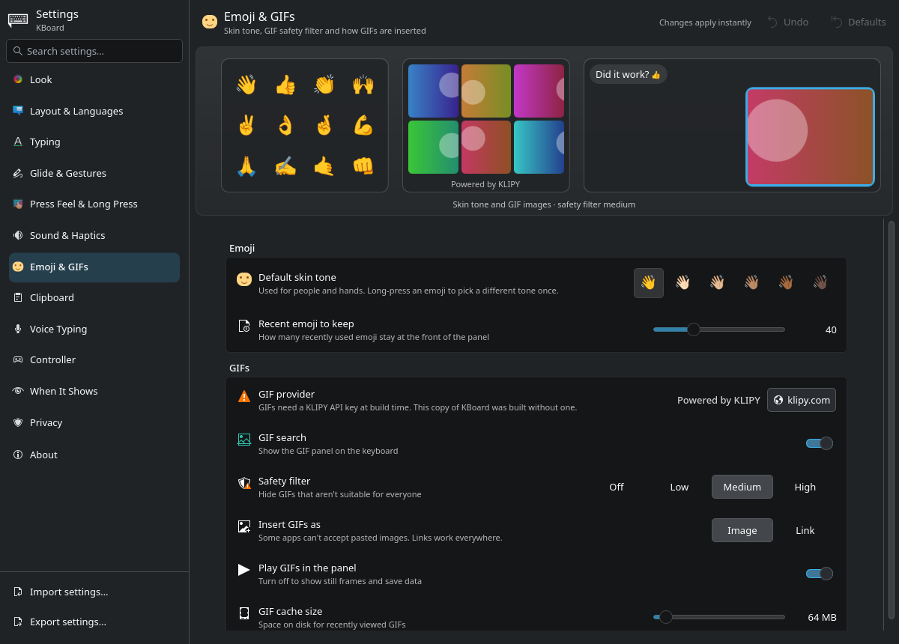<p align="center"><b>Emoji &amp; GIFs</b> — skin tone, safety filter, how GIFs go in</p></td>
    <td>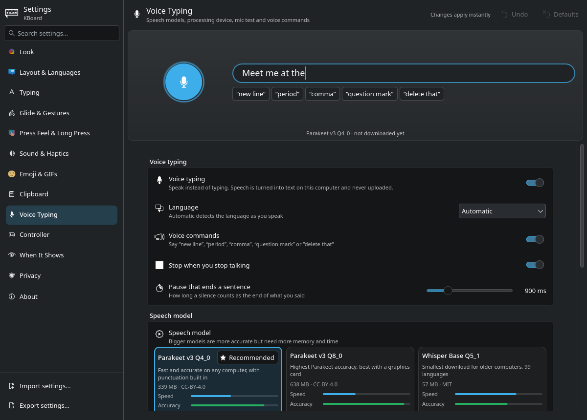<p align="center"><b>Voice Typing</b> — models, device, microphone test</p></td>
    <td>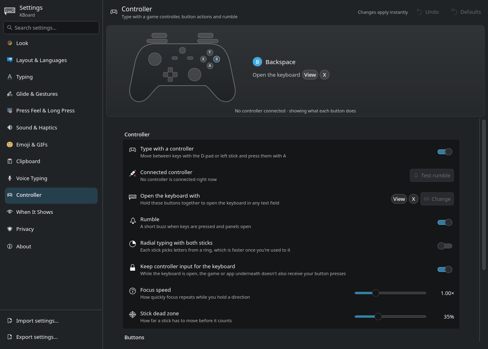<p align="center"><b>Controller</b> — button actions, chord, rumble, dead zone</p></td>
  </tr>
  <tr>
    <td>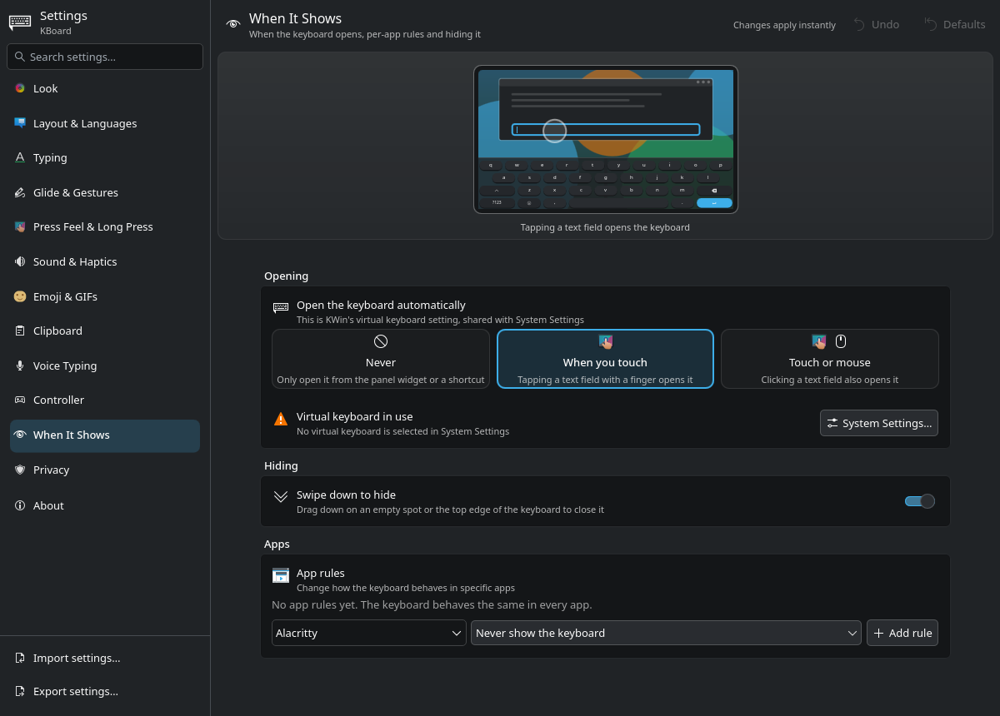<p align="center"><b>When It Shows</b> — touch or mouse, hiding, per-app rules</p></td>
    <td>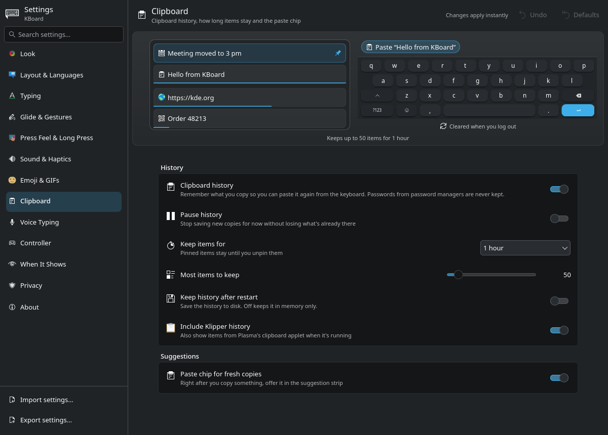<p align="center"><b>Clipboard</b> — history, how long items stay, paste chip</p></td>
    <td>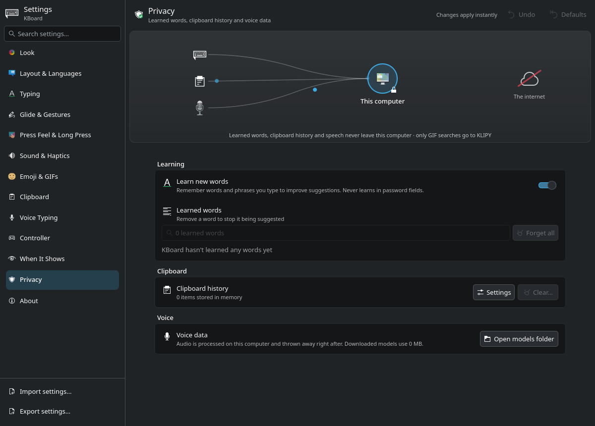<p align="center"><b>Privacy</b> — learned words, clipboard and voice data</p></td>
  </tr>
</table>

<p align="right"><a href="#top">back to top ⬆</a></p>

---


<a id="command-line"></a>

## ⌨️ Command line &amp; D-Bus

| Command | What it does |
| :-- | :-- |
| `qdbus6 org.devl0rd.KBoard /KBoard org.devl0rd.KBoard.Toggle` | Show the keyboard, or hide it if it's up |
| `qdbus6 org.devl0rd.KBoard /KBoard org.devl0rd.KBoard.Show` | Bring the keyboard up |
| `qdbus6 org.devl0rd.KBoard /KBoard org.devl0rd.KBoard.Hide` | Put it away |
| `qdbus6 org.devl0rd.KBoard /KBoard org.devl0rd.KBoard.OpenPanel emoji` | Open a panel: `keys`, `emoji`, `gif`, `clipboard`, `voice` or `edit` |
| `qdbus6 org.devl0rd.KBoard /KBoard org.devl0rd.KBoard.IsVisible` | Print whether it's showing |
| `qdbus6 org.devl0rd.KBoard /KBoard org.devl0rd.KBoard.CurrentPanel` | Print the panel that's open |
| `qdbus6 org.devl0rd.KBoard /KBoard org.devl0rd.KBoard.OpenSettings voice` | Open the settings app on a page |
| `kboard-settings --page sound` | Same thing, from a launcher or a script |
| `kboard-settings --page voice --reveal "Speech model"` | Open a page and highlight one row |
| `kboard-voice-model --list` | List the voice models and which ones you have |
| `kboard-voice-model whisper-large-v3-turbo-q5_0` | Download another model |
| `kboard-input-method enable` | Make KBoard KWin's on-screen keyboard again |
| `kboard-input-method restore` | Give the on-screen keyboard back to the one you had before |

`VisibleChanged` and `PanelChanged` are emitted on the same interface, so scripts and widgets can follow along.

Settings live in `~/.config/kboardrc`. Learned words, clipboard pins, emoji recents and voice models are in `~/.local/share/kboard`, and GIFs are cached in `~/.cache/kboard/gif`. Logs: `journalctl --user -u plasma-kwin_wayland.service -f`.

<p align="right"><a href="#top">back to top ⬆</a></p>

---

<a id="privacy"></a>

## 🔒 Privacy

- **What you type stays here.** Suggestions, autocorrect and prediction run on your machine from word lists that ship with KBoard, plus the words it learns from you in `~/.local/share/kboard`.
- **Nothing is learned in password fields.** When an app marks a field as a password or as sensitive, KBoard turns off suggestions, autocorrect and learning for it, and the clipboard refuses to store what you copy there. Anything a password manager marks as a secret is skipped too.
- **Voice typing is offline.** The model runs on your own CPU or graphics card. Audio is turned into text as you speak and thrown away right after; nothing is uploaded, and no account or key is needed.
- **The clipboard forgets.** History is kept in memory by default and cleared an hour after you copy something, up to 50 items. Pinned items stay until you remove them. Turn it off, pause it, or clear it from **Privacy**.
- **GIF search goes out.** Only the GIF panel talks to the internet. Searches and a random id that KBoard generates for itself go to [KLIPY](https://klipy.com), which serves the GIFs. Nothing about your typing goes with it, and turning off **GIF search** stops it entirely.
- **Clear it whenever.** **Privacy** lists every word KBoard learned, removes them one at a time or all at once, clears the clipboard history and opens the folder your voice models live in.

<p align="right"><a href="#top">back to top ⬆</a></p>

---

<a id="faq"></a>

## 💬 Questions

<details>
<summary><b>Does it work in X11 apps?</b></summary>
<br>
Wayland apps tell KWin when a text field has focus, so the keyboard comes up on its own. Older X11 apps running through XWayland don't, so open the keyboard yourself with the controller chord or D-Bus, and it types into the app through KWin. Suggestions that read the text around your cursor have nothing to read in those apps.
</details>

<details>
<summary><b>What happens to plasma-keyboard?</b></summary>
<br>
Nothing. KWin starts one on-screen keyboard, and the installer remembers the one you had before switching it to KBoard. <code>./uninstall.sh</code>, or <code>kboard-input-method restore</code>, hands it straight back.
</details>

<details>
<summary><b>Why not just improve plasma-keyboard?</b></summary>
<br>
KBoard keeps plasma-keyboard's Wayland plumbing and builds a different keyboard on top: suggestions, autocorrect, glide typing, emoji, GIFs, clipboard history, offline voice typing, controller input, sounds and a settings app with live previews. That's a different project, not a patch.
</details>

<details>
<summary><b>Does voice typing need a graphics card?</b></summary>
<br>
No. The model that comes with KBoard is quick enough on a plain CPU. If you install <code>ggml-cuda</code>, <code>ggml-vulkan</code> or <code>ggml-hip</code>, it uses your NVIDIA, AMD or Intel card instead, and <b>Voice Typing → Processing device</b> shows what it picked and lets you choose. The model is unloaded after five idle minutes to give the memory back.
</details>

<details>
<summary><b>Which languages can it understand?</b></summary>
<br>
Parakeet v3, the model installed by default, covers 25 European languages. For anything else, pick a Whisper model under <b>Speech model</b> — Large v3 Turbo covers 99 languages — or download it up front with <code>kboard-voice-model</code>.
</details>

<details>
<summary><b>I use Steam. Will my controller type twice?</b></summary>
<br>
No. Steam Input adds a virtual pad next to your real one, and KBoard pairs the two so a button press counts once. Plug a controller in while the keyboard is open and it's picked up straight away.
</details>

<details>
<summary><b>Do I need an API key for GIFs?</b></summary>
<br>
Not as a user. GIFs come from KLIPY and the key is compiled into KBoard. If the panel says <b>GIFs are not set up</b>, the build had no key: get a free one from KLIPY's partner panel and run <code>KBOARD_KLIPY_API_KEY=yourkey ./install.sh</code>.
</details>

<details>
<summary><b>The keyboard doesn't come up when I click a field.</b></summary>
<br>
Plasma only opens the on-screen keyboard for touch by default. Set <b>When It Shows → Open the keyboard automatically</b> to <b>Touch or mouse</b>, which is the same setting as System Settings' virtual keyboard mode.
</details>

---

<a id="more"></a>

## 🧰 More from DevL0rd

Other Plasma projects made to sit on the same desktop. Click a banner to open it on GitHub.

<p align="center">
  <a href="https://github.com/DevL0rd/Konveyor">
    <picture>
      <source media="(prefers-color-scheme: dark)" srcset="docs/media/more/konveyor-dark.svg">
      <source media="(prefers-color-scheme: light)" srcset="docs/media/more/konveyor-light.svg">
      
    </picture>
  </a>
  <br>
  <a href="https://github.com/DevL0rd/Konveyor"><b>Konveyor</b></a> · Your windows, on a conveyor belt.
</p>

<p align="center">
  <a href="https://github.com/DevL0rd/RVC-Voice-Changer">
    <picture>
      <source media="(prefers-color-scheme: dark)" srcset="docs/media/more/rvc-voice-changer-dark.svg">
      <source media="(prefers-color-scheme: light)" srcset="docs/media/more/rvc-voice-changer-light.svg">
      
    </picture>
  </a>
  <br>
  <a href="https://github.com/DevL0rd/RVC-Voice-Changer"><b>RVC Voice Changer</b></a> · Sound like anyone, in every app.
</p>

<p align="center">
  <a href="https://github.com/DevL0rd/Android-Daemon">
    <picture>
      <source media="(prefers-color-scheme: dark)" srcset="docs/media/more/android-daemon-dark.svg">
      <source media="(prefers-color-scheme: light)" srcset="docs/media/more/android-daemon-light.svg">
      
    </picture>
  </a>
  <br>
  <a href="https://github.com/DevL0rd/Android-Daemon"><b>Android-Daemon</b></a> · Your phone, right on your desktop.
</p>

<p align="center">
  <a href="https://github.com/DevL0rd/Syncthing-Monitor">
    <picture>
      <source media="(prefers-color-scheme: dark)" srcset="docs/media/more/syncthing-monitor-dark.svg">
      <source media="(prefers-color-scheme: light)" srcset="docs/media/more/syncthing-monitor-light.svg">
      
    </picture>
  </a>
  <br>
  <a href="https://github.com/DevL0rd/Syncthing-Monitor"><b>Syncthing Monitor</b></a> · Your sync, at a glance.
</p>

---

<p align="center">
  Released under the <a href="LICENSE">GPL-3.0-only License</a>. See <a href="THIRD_PARTY_NOTICES.md">THIRD_PARTY_NOTICES.md</a> for the projects, models and data it builds on.<br>
  Built on plasma-keyboard's Wayland input-method plumbing, with voice typing by whisper.cpp and NVIDIA's Parakeet model, and GIFs by KLIPY.
</p>

<p align="center"><a href="#top">back to top ⬆</a></p>
